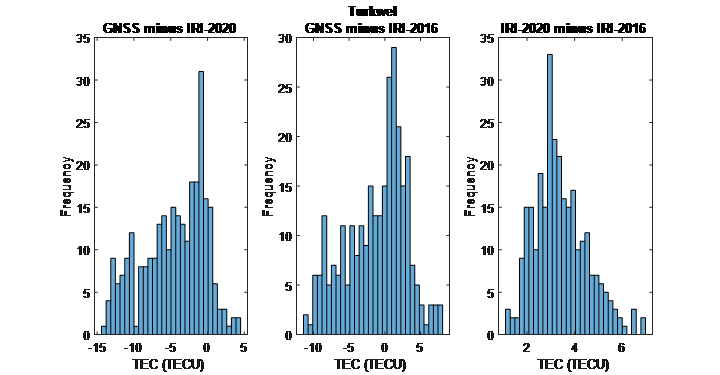

## Space Physicist & Data Scientist

### Formal Education

- Ph.D. in Space physics, Bahir Dar University, Ethiopia (February 2021)
- M.Sc. in Space physics, Bahir Dar University, Ethiopia (June 2011)
- B.Sc. in Physics, Bahir Dar University, Ethiopia (June 2009)

### Data Science Education
##### Google / Advanced Data Analytics Professional Certificate
March  2024 - May 2024,  Online (Coursera)

An extensive Three-month job-ready Google Career Certificate training. Demonstrated hands-on experience with advanced Data Analytics practices and tools, including data science workflows, Python programming and Tableau. Confidence in exploratory data analysis; statistical data analysis; regression analysis and data modeling, and machine learning basics.
##### Python for Data Science and Machine Learning
January  2024 - February 2024,  Online (UDemy)
##### The Complete Python Bootcamp From Zero to Hero in Python
October  2023 - December 2023,  Online (UDemy)

### Softwares and Skills
- Programming Languages: MATLAB, Python
- Python Packages: numpy, Pandas, Scipy, seaborn, Matplotlib, statsmodels, scikit-learn
- Machine Learning Models: regression (linear, logistic), Naive Bayes, decision trees, random forest, AdaBoost, XGBoost
- Data Science (Data cleaning, Data structuring, Data analysis)

### Work Experiance
- Postdoctoral Researcher, Czech Academy of Sciences, Czech Republic, April 2023 – present.
- Assistant Professor of Space physics, Debre Tabor University, Ethiopia, January 2021 – March 2023.
- Lecturer at Debre Tabor University, Debre Tabor, Ethiopia, July 2011 – December, 2016.

### Data Analytics Projects
- Classification of Waze data: Built decision tree, random forest, and XGBoost to predict Waze user churn

#### Waze App oroject 1

##### Project Overview
- A project overview should be a few sentences long stating the problem you solved, what data was used in the project, and your modeling results. 
##### Business Understanding 
- You should have a section that showcases the stakeholder(s) and the business problem you tried to solve. Feel free to add citations of research you did on your business problem here as well. 
##### Data Understanding 
- Explain what data you used in your analysis, the timeframe of the data, and any data limitations. This is also a good section to add visualizations of your exploratory data analysis. 
##### Modeling and Evaluation 
- This section should detail what models you used and the corresponding evaluation metrics. 
##### Conclusion
- In the conclusion section explain the recommendations you have in solving the business problem and highlight any future steps you will take to expand on your project, 

### Space Science Projects
- Upper atmosphere dynamics
- Coupling between Ionosphere and atmosphere
- Ionospheric irregularities
- Satellite data processing and analysis

### Main outcomes (Space Physics)
#### Modeling Plasma drift velocity
[Publication](https://agupubs.onlinelibrary.wiley.com/doi/epdf/10.1029/2019RS006800)

To understand the dynamics of the equatorial ionosphere and mitigate its effect on radio wave propagation, vertical ion drift velocity empirical models have been developed using limited ground‐based and/or space‐based observations. These models, however, have not yet been validated in detail using recent observations for sufficiently different longitudinal sectors. In this paper we have evaluated the performance of two empirical models and also propose a simplified vertical drift velocity model based on basic physics laws (i.e., Ampere's and Ohm's laws) that we call it parameterized drift velocity (PDV) model. These models have been applied to estimate the Eregion electric field and the associated F region E×B drift velocity using observed horizontal magnetic fields, due to equatorial electrojet current, as model driver input. Drift velocities obtained from these models are compared with the Communication/Navigation Outage Forecasting System (C/NOFS) satellite in situ vertical drift observations for different longitudinal sectors.

 

#### Valdation of International Reference Ionosphere Model (IRI-2020 TEC)
[Publication](https://www.sciencedirect.com/science/article/pii/S0273117723007913)

We evaluated and reported the International Reference Ionosphere (IRI) model's vertical Total Electron Content (TEC) regional profile. Diurnal, monthly, seasonal, and storm-time characteristics of IRI estimates over the equatorial region's ionosphere are validated. We compared the vertical TEC derived from IRI-2020 and its predecessor, IRI-2016, with the GPS-TEC measurements.
 

<a href="https://github.com/Habtamu-Alemu/Portfolio/Resume_2023.pdf" target="_blank">Full Resume</a>
